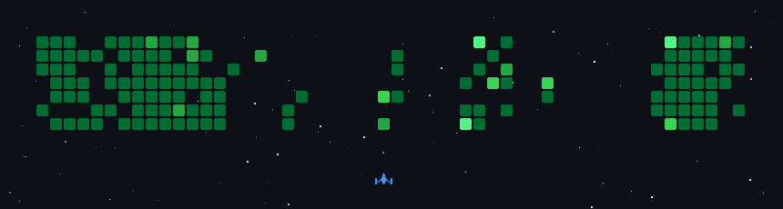

<h1 align="center">😎 Mr_Saxena</h1>

Engineering solutions that scale with clarity, performance and intent 💪.

  

<h1 align="left" >👋 I'm Kshitij Saxena</h1>

A versatile designer who partners with founders to turn ideas into real products.   Also focus on clear interfaces, sharp decisions, and fast execution.

Full stack developer with a knack for crafting robust and scalable web applications. with in past years of hands on experience, I have honed my skills in front-end technologies like React and Next.js, as well as back end technologies like Node.js, MySQL, PostgreSQL, and MongoDB. My goal is to leverage my expertise to create innovative solutions that drive business growth and deliver exceptional user experiences.

---

## 🚀 Currently Working On

- ⚡ Designing scalable full stack architectures  
- 🧠 Exploring system design, performance optimization and backend scalability  
- 📏 Developing AR based measurement and computer vision applications  
- 🤖 Building AI powered automation tools and assistants  

---

## ⚡ What Makes Me Different

✔ Performance-first engineering mindset  
✔ Clean UI + strong UX decision making  
✔ Scalable backend architecture focus  
✔ Fast execution from idea → production  
✔ Building real-world problem solving products  

---

## 🌱 Currently Learning

- Advanced system design patterns  
- AI model optimization and integrations  
- Cloud architecture and deployment strategies  
- High performance backend engineering  

---

## 💬 Ask Me About

- Full stack development (React, Next.js, Node.js)  
- Backend architecture & APIs  
- AI integrations and automation tools  
- AR / Computer Vision projects  
- Product development from scratch  

---
## My Skill Set  
<table><tr><td valign="top" width="33%">

### Frontend  

  
  
  
  
  
  
  
  
  
  
  
  
  
  
  
  

</td><td valign="top" width="33%">

### Backend  

  
  
  
  
  
  
  
  
  
  
  
  
  
  
  

</td><td valign="top" width="33%">

### DevOps  

  
  
  
  
  

</td></tr></table>  
<!-- 

 -->
## 📊 GitHub Stats

  

 

### 📫 Connect With Me  

- 🌍 Portfolio: <a href="https://mrsaxena.arisertradco.com">Mr_Saxena</a>
- 📬 Mail: <a href="https://mail.google.com/mail/?view=cm&fs=1&to=kshitijsaxena9@gmail.com&su=Hello%20from%20your%20portfolio!&body=Hi%20there,%0A%0AI%20found%20your%20portfolio%20and%20wanted%20to%20reach%20out.%0A%0ABest%20regards,%0A[Your%20Name]">kshitijsaxena9@gmail.com</a>

